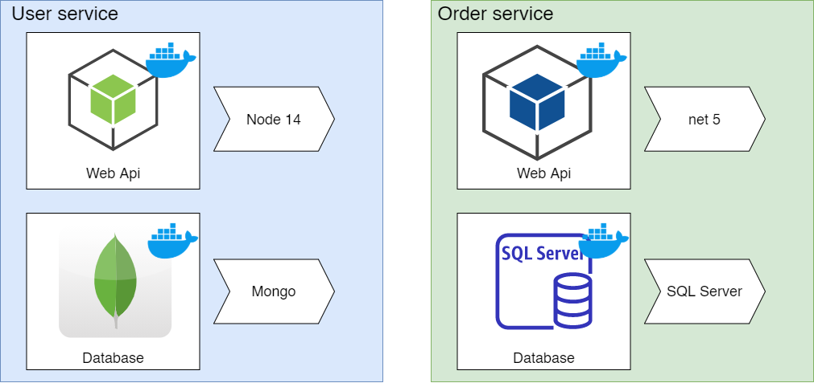

# Parrot Challenge

## Architecture

DOckerized microservice environment



## Rquirements

* Docker 
* Postman 

## Setup 

1. Clone this repo
2. Open a console in the folder
3. Execute `docker-compose build`
4. Execute `docker-compose up`

## Test with Postman

This repo includes an archive [postman.json][postman.json] with the postman collection to test the endpoints.

### Users => Create
Create an user with email and name

### Users => Login
Get a jwt for an email

### Orders => Create
Create an order with products, this is the structore of the request

```json
{
    "ClientName" :"Name",
    "OrderProducts": [{
        "ProductName": "Product 1",
        "UnitPrice": 120,
        "Quantity": 10
    }, {
        "ProductName": "Product 2",
        "UnitPrice": 140,
        "Quantity": 10
    }]
}
```

### Orders => Report
Get a report of sales per product. The filtering is by date in query params

`?startDate=2021-01-01&endDate=2021-12-31`

## Technologies
* NodeJs + Mongo for user management
* Net 5 + SQL Server for oder management

## Docker containers
* NodeJs app
* Mongo server
* Net 5 app
* SQL Server 
